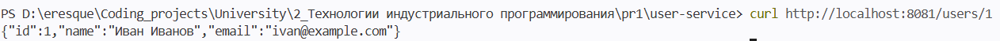
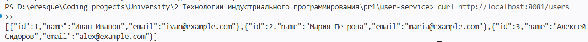
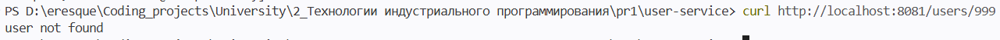
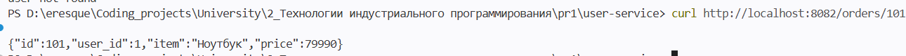
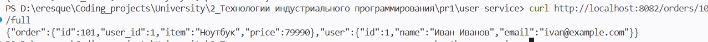
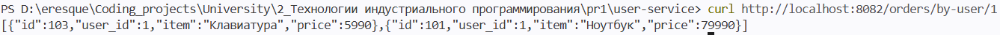

# Фамилия Имя Отчество, ЭФМО-01-25

# Практическое занятие №1. Разделение монолита на 2 микросервиса. Взаимодействие через HTTP

# Ключевые технологии:
Go 1.21+, HTTP, REST, env-конфигурация, таймауты, logging middleware, in-memory хранилище.

# Цель
Освоить базовый подход к переходу от монолитного backend-приложения к микросервисной архитектуре на основе разделения системы на два самостоятельных сервиса и организации их взаимодействия по HTTP.

# Описание границ сервисов

## **User Service**

User Service отвечает за хранение и предоставление информации о пользователях. Сервис принимает запросы на получение пользователя по ID, а также возвращает список всех пользователей. Данные хранятся в памяти.

## **Order Service**

Order Service отвечает за управление заказами. Сервис позволяет получать заказ по ID, получать список всех заказов конкретного пользователя, а также агрегированный ответ — заказ вместе с данными пользователя. Для получения данных о пользователе Order Service обращается к User Service по HTTP. Заказы хранятся в памяти сервиса.


# Дерево проекта
```
pr1/
├── user-service/
│   ├── cmd/
│   │   └── server/
│   │       └── main.go          # точка входа, порт 8081, logging middleware
│   ├── internal/
│   │   └── user/
│   │       ├── model.go         # структура User
│   │       ├── repo.go          # in-memory хранилище, GetAll, GetByID
│   │       └── handler.go       # GetUsers, GetUserByID
│   └── go.mod
│
└── order-service/
    ├── cmd/
    │   └── server/
    │       └── main.go          # точка входа, порт 8082, logging middleware, USER_SERVICE_URL
    ├── internal/
    │   └── order/
    │       ├── model.go         # Order, UserDTO, OrderWithUser
    │       ├── repo.go          # in-memory хранилище, GetByID, GetByUserID
    │       ├── handler.go       # GetOrderByID, GetOrderWithUser, GetOrdersByUser
    │       └── client.go        # HTTP-клиент для вызова User Service
    └── go.mod
```

# Запуск

## User Service:
```
cd user-service
go run ./cmd/server
```

## Order Service:
```
cd order-service
go run ./cmd/server
```

Адрес User Service можно переопределить через переменную окружения:
```
USER_SERVICE_URL=http://localhost:8081 go run ./cmd/server
```

# Список эндпоинтов и кодов ответов

## **User Service**

### Эндпоинты

| Метод | Эндпоинт | Описание |
|-------|----------|----------|
| `GET` | `/users` | Получение списка всех пользователей |
| `GET` | `/users/{id}` | Получение пользователя по ID |

### Коды ответов

| Код | Описание | Когда возникает |
|-----|----------|-----------------|
| `200 OK` | Успешный запрос | Пользователь найден, список получен |
| `400 Bad Request` | Неверный формат запроса | ID не является числом |
| `404 Not Found` | Не найдено | Пользователь с таким ID не существует |
| `405 Method Not Allowed` | Метод не разрешён | Запрос не через GET |

---

## **Order Service**

### Эндпоинты

| Метод | Эндпоинт | Описание |
|-------|----------|----------|
| `GET` | `/orders/{id}` | Получение заказа по ID |
| `GET` | `/orders/{id}/full` | Получение заказа вместе с данными пользователя |
| `GET` | `/orders/by-user/{userID}` | Получение всех заказов пользователя |

### Коды ответов

| Код | Описание | Когда возникает |
|-----|----------|-----------------|
| `200 OK` | Успешный запрос | Заказ найден, список получен |
| `400 Bad Request` | Неверный формат запроса | ID не является числом |
| `404 Not Found` | Не найдено | Заказ с таким ID не существует |
| `405 Method Not Allowed` | Метод не разрешён | Запрос не через GET |
| `502 Bad Gateway` | Ошибка внешнего сервиса | User Service недоступен при вызове `/full` |

---

# Тестирование

- Получить пользователя по ID
```
curl http://localhost:8081/users/1
```


- Получить список всех пользователей
```
curl http://localhost:8081/users
```


- Попробовать несуществующего пользователя
```
curl http://localhost:8081/users/999
```


- Получить заказ по ID
```
curl http://localhost:8082/orders/101
```


- Получить заказ с данными пользователя
```
curl http://localhost:8082/orders/101/full
```


- Получить все заказы пользователя
```
curl http://localhost:8082/orders/by-user/1
```


# Логирование

Оба сервиса используют logging middleware, который выводит в консоль метод запроса, путь и время выполнения:

```
# user-service
2025/01/01 12:00:00 user-service started on :8081
2025/01/01 12:00:01 GET /users/1 54.3µs
2025/01/01 12:00:02 GET /users 12.1µs

# order-service
2025/01/01 12:00:00 order-service started on :8082
2025/01/01 12:00:00 user-service URL: http://localhost:8081
2025/01/01 12:00:03 GET /orders/101 87.2µs
2025/01/01 12:00:04 GET /orders/101/full 1.2ms
```


# Контрольные вопросы

1. **Чем монолит отличается от микросервисной архитектуры?**
   В монолите все функции системы находятся в одном процессе и взаимодействуют через прямые вызовы функций. В микросервисной архитектуре система разбита на независимые сервисы, каждый из которых отвечает за свою бизнес-область и взаимодействует с другими по сети.

2. **Почему разделение системы на сервисы не всегда является лучшим решением?**
   Микросервисы усложняют инфраструктуру, тестирование, мониторинг и отладку. Появляются сетевые задержки, необходимость обрабатывать частичные отказы и проектировать межсервисные API. Для небольших проектов монолит проще и дешевле в поддержке.

3. **Какую ответственность несёт user-service, а какую — order-service?**
   User Service отвечает только за хранение и предоставление данных о пользователях. Order Service отвечает только за заказы. Для получения полной информации о заказе Order Service запрашивает данные пользователя у User Service по HTTP, не имея прямого доступа к его коду или данным.

4. **Почему в микросервисной архитектуре важно обрабатывать таймауты и сетевые ошибки?**
   Если один сервис не отвечает, вызывающий сервис может бесконечно ждать ответа, блокируя свои ресурсы. Таймаут ограничивает время ожидания и позволяет вернуть понятную ошибку клиенту, предотвращая каскадный отказ всей системы.

5. **Что означает статус 502 Bad Gateway в контексте взаимодействия сервисов?**
   502 означает, что сервис, выступающий посредником, не смог получить корректный ответ от вышестоящего сервиса. В данной работе Order Service возвращает 502, когда User Service недоступен или вернул ошибку при запросе данных пользователя.

6. **Почему один сервис не должен напрямую обращаться к внутренним структурам кода другого сервиса?**
   Прямой доступ к коду создаёт жёсткую связность: любое изменение внутренней реализации одного сервиса немедленно сломает другой. Взаимодействие только через публичный HTTP API позволяет каждому сервису развиваться независимо.

7. **Какие преимущества даёт разделение на сервисы при росте проекта?**
   Разные команды могут работать над разными сервисами независимо, каждый сервис можно деплоить и масштабировать отдельно, нагрузку можно распределять точечно, а отказ одного компонента не обязательно роняет всю систему.

8. **Какие новые сложности появляются после такого разделения?**
   Необходимо контролировать сетевые ошибки и таймауты, следить за адресами сервисов, проектировать и версионировать межсервисные API, настраивать мониторинг для нескольких процессов, а также учитывать, что отказ одного сервиса влияет на работу других.
