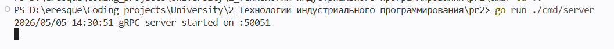
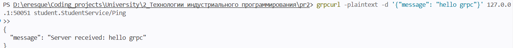
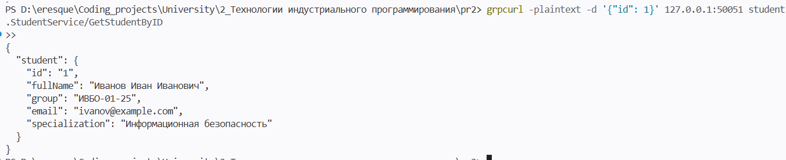
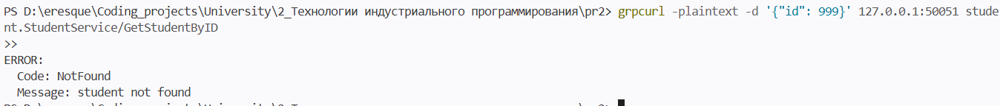
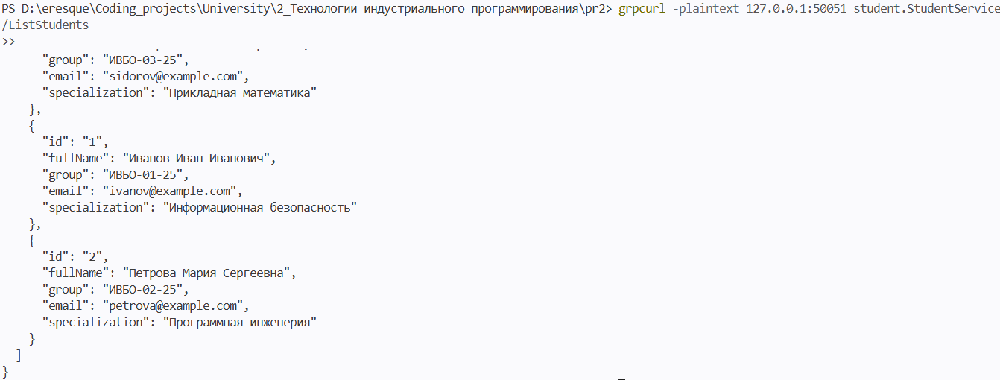
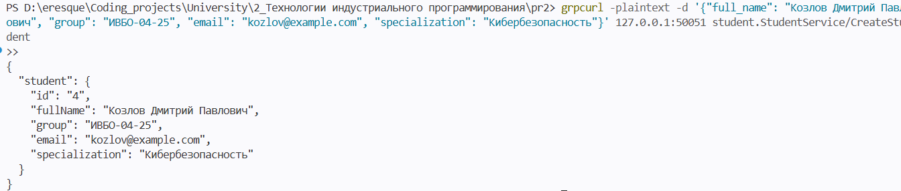

# Практическое занятие №2
# gRPC: создание простого микросервиса, вызовы методов

**Дисциплина:** Технологии индустриального программирования  
**Студент:** Гордеев Артём Ильич, ЭФМО-01-25

---

## Требования к проекту

- Go 1.21+
- Установленный protoc
- Установленные плагины protoc-gen-go и protoc-gen-go-grpc
- Свободный порт 50051
- Зависимости: google.golang.org/grpc, google.golang.org/protobuf


---

## Краткое описание проекта

Реализован простой gRPC-микросервис **StudentService** с методами:
- `Ping` — проверка связи,
- `GetStudentByID` — получение студента по ID,
- `ListStudents` (доп. задание 1) — получение списка всех студентов,
- `CreateStudent` (доп. задание 2) — добавление нового студента в память.

Структура `Student` расширена полем `specialization` (доп. задание 3).

Сервер хранит данные в памяти. Клиент подключается к серверу по gRPC и выполняет вызовы всех методов, включая проверку сценария ошибки `NotFound`. Контракт описан в proto-файле, код сгенерирован с помощью protoc и плагинов protoc-gen-go / protoc-gen-go-grpc.

---

## Структура проекта

```
pr2/
├── proto/
│   └── student.proto
├── cmd/
│   ├── server/
│   │   └── main.go
│   └── client/
│       └── main.go
├── internal/
│   └── student/
│       ├── data.go
│       └── service.go
├── gen/
│   └── studentpb/
│       ├── student.pb.go
│       └── student_grpc.pb.go
└── go.mod
```

---


## Результаты выполнения (скриншоты)

### Запуск gRPC-сервера


### Ping


### GetStudentByID


### Ошибка при запросе несуществующего студента


### Список студентов — ListStudents (доп. задание 1)


### Создание студента — CreateStudent (доп. задание 2)


---

## Ответы на контрольные вопросы

**1. Что такое gRPC?**  
gRPC — это фреймворк удалённого вызова процедур, позволяющий одному приложению вызывать методы другого так, будто это локальные методы. Интерфейс сервиса описывается в .proto-файле, а затем генерируется типизированный код клиента и сервера.

**2. Какую роль играет .proto-файл?**  
В .proto-файле описываются структуры данных (сообщения) и сервисы с их методами. Это контракт, на основе которого генерируется код для разных языков. Он гарантирует строгую типизацию и однозначное понимание API между клиентом и сервером.

**3. Для чего нужен protoc?**  
protoc — это компилятор protobuf-описаний. Он обрабатывает .proto-файлы и с помощью плагинов генерирует код на целевых языках (в нашем случае Go).

**4. Зачем используются protoc-gen-go и protoc-gen-go-grpc?**  
protoc-gen-go генерирует Go-код для работы с protobuf-сообщениями (сериализация, десериализация). protoc-gen-go-grpc генерирует интерфейсы сервисов, клиентские и серверные привязки для gRPC.

**5. Чем gRPC отличается от HTTP JSON API?**  
В HTTP JSON API разработчик вручную проектирует URL, форматы JSON, обработчики и документацию. В gRPC контракт формально описан в .proto-файле, взаимодействие строится вокруг методов сервиса, данные типизированы, а код клиента и сервера генерируется автоматически. HTTP JSON API обычно удобнее для внешних публичных запросов, а gRPC — для внутреннего межсервисного взаимодействия.

**6. Почему контракт в gRPC считается строго типизированным?**  
Потому что все поля сообщений и сигнатуры методов заданы в .proto с указанием типов. Генерируемый код обеспечивает проверку типов на этапе компиляции, исключая многие ошибки несоответствия данных.

**7. Что делает gRPC-клиент в этой работе?**  
Клиент подключается к серверу по адресу `127.0.0.1:50051`, создаёт заглушку (stub) из сгенерированного кода и вызывает удалённые методы: `Ping`, `GetStudentByID`, `ListStudents` и `CreateStudent`. Он получает структурированные ответы и выводит их в консоль.

**8. Что происходит, если клиент запрашивает несуществующего студента?**  
Сервер возвращает gRPC-ошибку с кодом `NotFound` через `status.Error(codes.NotFound, ...)`. Клиент получает эту ошибку, логирует её как ожидаемую и продолжает выполнение следующих вызовов.

**9. Почему для локальной учебной среды допустимо использовать insecure credentials?**  
Insecure credentials отключают шифрование TLS, что упрощает запуск и отладку. В реальных системах так делать нельзя, но для локальных экспериментов это допустимо и широко используется в официальных примерах.

**10. В каких случаях gRPC особенно удобен в backend-разработке?**  
gRPC удобен для внутреннего взаимодействия микросервисов, когда нужна высокая производительность, строгая типизация, автоматическая генерация клиентского кода, поддержка стриминга и чёткий контракт между сервисами.
