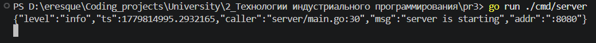
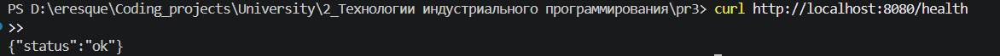
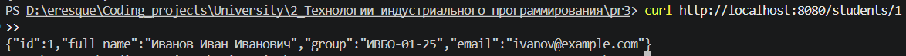
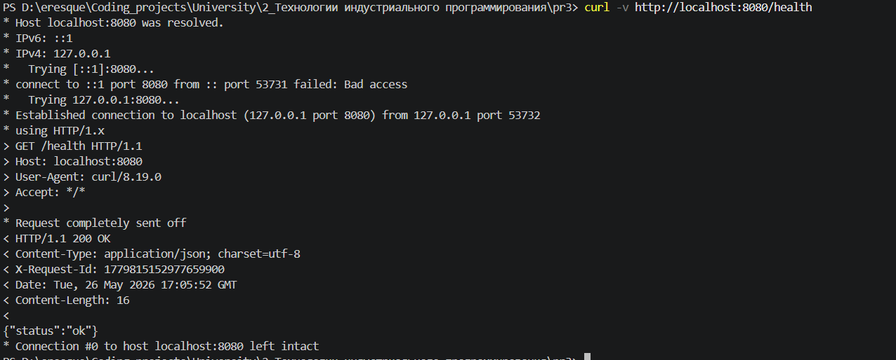
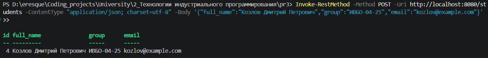
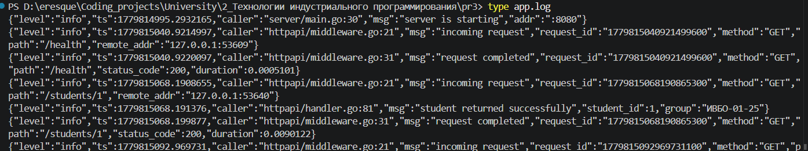

# Практическое занятие №3
# Логирование с помощью zap. Ведение структурированных логов

**Дисциплина:** Технологии индустриального программирования  
**Студент:** Гордеев Артём Ильич, ЭФМО-01-25

---

## Требования к проекту

- Go 1.21+
- Зависимости: go.uber.org/zap
- Свободный порт 8080

---

## Краткое описание проекта

Реализован учебный HTTP-сервис с двумя основными маршрутами:
- `GET /health` — проверка работоспособности,
- `GET /students/{id}` — получение студента по идентификатору.

В приложение встроен структурированный логгер **zap** с выводом в `stdout` и в файл `app.log` (доп. задание 1). Через middleware логируются все входящие запросы и завершение их обработки с полями: метод, путь, статус, длительность, `request_id`.

Выполнены все четыре дополнительных задания:
1. Логирование в файл (`app.log`) наряду с `stdout`.
2. Передача `request_id` в HTTP-заголовок ответа `X-Request-ID`.
3. Debug-лог перед обращением к репозиторию (`looking up student in repository`).
4. Маршрут `POST /students` — создание студента с логированием тела, ошибок валидации и успешного создания.

---

## Структура проекта

```
pr3/
├── cmd/
│   └── server/
│       └── main.go
├── internal/
│   ├── httpapi/
│   │   ├── handler.go
│   │   ├── middleware.go
│   │   └── response_writer.go
│   └── student/
│       ├── model.go
│       └── repo.go
├── pkg/
│   └── logger/
│       └── logger.go
└── go.mod
```

---

## Результаты выполнения (скриншоты)

### Запуск сервера

Команда запуска (из папки `pz3-logging`):
```
go run ./cmd/server
```



### GET /health — проверка состояния

```
curl http://localhost:8080/health
```



### GET /students/1 — успешное получение студента

```
curl http://localhost:8080/students/1
```



### GET /students/abc — ошибка неверного идентификатора (400)

```
curl http://localhost:8080/students/abc
```


### GET /students/999 — студент не найден (404)

```
curl http://localhost:8080/students/999
```


### Доп. задание 2 — X-Request-ID в заголовке ответа

```
curl -v http://localhost:8080/health
```



### Доп. задание 4 — POST /students — создание студента

```powershell
Invoke-RestMethod -Method POST -Uri http://localhost:8080/students -ContentType "application/json; charset=utf-8" -Body '{"full_name":"Козлов Дмитрий Петрович","group":"ИВБО-04-25","email":"kozlov@example.com"}'
```



### Доп. задание 1 — содержимое файла app.log

```
type app.log
```



---

## Ответы на контрольные вопросы

**1. Зачем backend-приложению нужно логирование?**  
Логи — основной инструмент наблюдаемости: по ним разработчик видит, что происходило в системе, какие запросы приходили, какие ошибки возникали и сколько времени заняла обработка. Без логов диагностика инцидентов практически невозможна.

**2. Чем обычный текстовый лог отличается от структурированного?**  
Текстовый лог — это произвольная строка, понятная человеку, но неудобная для автоматической обработки. Структурированный лог — это запись с фиксированными полями в формате ключ-значение (например, JSON), которую можно фильтровать, индексировать и агрегировать по конкретным полям.

**3. Что означает structured logging?**  
Это подход, при котором каждое событие лога содержит сообщение, уровень важности и набор именованных полей. Это позволяет искать записи по `student_id`, `status_code`, `path` и другим полям, а не только по тексту.

**4. Какие уровни логирования используются в этой работе?**  
`Debug` — отладочные сведения (например, начало поиска в репозитории); `Info` — нормальные рабочие события (старт сервера, успешный ответ); `Warn` — ситуации отклонения от нормы (неверный ID, недопустимый метод); `Error` — операция завершилась неудачей (студент не найден).

**5. Почему полезно логировать HTTP-метод, путь и статус ответа?**  
Эти три поля вместе описывают каждый запрос однозначно: какой ресурс запрашивался, каким методом и с каким результатом. При анализе инцидентов это позволяет сразу понять, что именно произошло и был ли ответ успешным.

**6. Зачем в лог добавляют время выполнения запроса?**  
Длительность обработки позволяет обнаруживать деградацию производительности: если запрос, который обычно выполняется за 5 мс, вдруг занял 2 секунды, это видно в логах.

**7. Почему логирование ошибок должно содержать дополнительный контекст?**  
Строка "student not found" без контекста бесполезна при расследовании. Добавляя `student_id` и текст ошибки, разработчик сразу видит, что именно искали и почему произошёл сбой, без необходимости воспроизводить ситуацию.

**8. В чём практическое преимущество zap?**  
zap отличается высокой производительностью (минимальные аллокации), строгой типизацией полей через `zap.String`, `zap.Int` и т.д., а также гибкой конфигурацией. Для production-сервисов это позволяет вести подробное логирование без заметного влияния на пропускную способность.

**9. Что означает maintenance mode у logrus?**  
Репозиторий logrus находится в режиме сопровождения: критические баги исправляются, но новые возможности не добавляются. Это означает, что для новых проектов предпочтительнее выбирать zap или стандартный `log/slog`.

**10. Почему structured logging особенно важен для микросервисов и backend API?**  
В распределённой архитектуре запрос проходит через несколько сервисов. Структурированные логи с общими полями (`request_id`, `trace_id`) позволяют собирать полную картину из разных источников. Кроме того, системы наблюдаемости (ELK, Grafana Loki) работают именно с полями JSON, а не с произвольным текстом.
