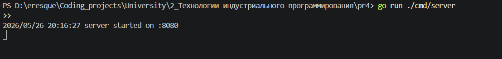
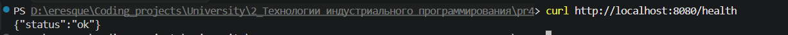
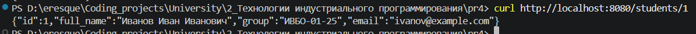
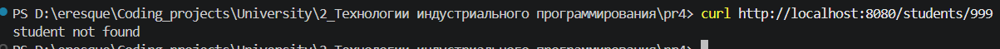
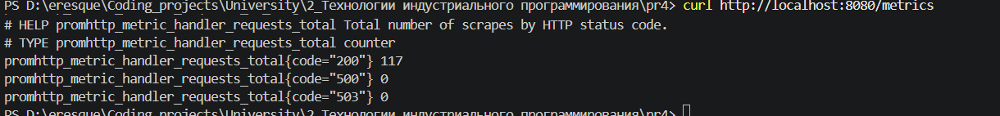
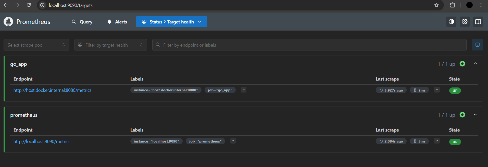
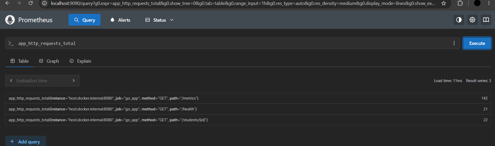
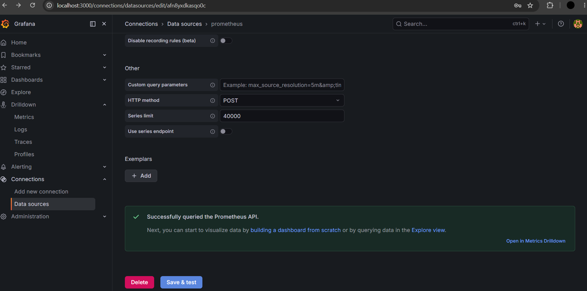
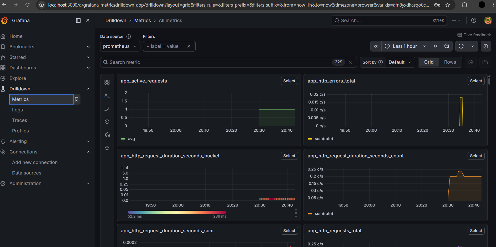

# Практическое занятие №4
# Настройка Prometheus + Grafana для метрик. Интеграция с приложением

**Дисциплина:** Технологии индустриального программирования  
**Студент:** Гордеев Артём Ильич, ЭФМО-01-25

---

## Требования к проекту

- Go 1.21+
- Prometheus (локальный бинарный файл или Docker)
- Grafana (локальная установка или Docker)
- Свободные порты: 8080 (приложение), 9090 (Prometheus), 3000 (Grafana)
- Зависимости: github.com/prometheus/client_golang

---

## Краткое описание проекта

Реализован HTTP-сервер на Go с экспортом метрик в формате Prometheus. Сервер предоставляет маршруты:
- `GET /health` — проверка состояния сервиса,
- `GET /students/{id}` — получение студента по ID,
- `GET /metrics` — эндпоинт для сбора метрик Prometheus.

Три базовые метрики приложения:
- `app_http_requests_total` (Counter) — общее число HTTP-запросов,
- `app_http_errors_total` (Counter) — число ошибочных ответов (HTTP >= 400),
- `app_http_request_duration_seconds` (Histogram) — длительность обработки.

Метрики записываются через middleware, который оборачивает все маршруты. Path нормализуется: `/students/1`, `/students/2` → `/students/{id}`, чтобы не создавать отдельный label на каждый ID.

Дополнительно реализованы все 4 варианта из раздела «Дополнительные задания»:
- `app_student_requests_total` (Counter) с лейблом `student_id` — доп. задание 1,
- `app_student_request_duration_seconds` (Histogram) только для `/students/{id}` — доп. задание 2,
- `app_active_requests` (Gauge) — текущее число обрабатываемых запросов — доп. задание 3,
- PromQL-запросы для отдельного дашборда ошибок описаны в README — доп. задание 4.

---

## Структура проекта

```
pr4/
├── cmd/
│   └── server/
│       └── main.go
├── internal/
│   ├── httpapi/
│   │   ├── handler.go
│   │   ├── middleware.go
│   │   └── response_writer.go
│   ├── metrics/
│   │   └── metrics.go
│   └── student/
│       ├── model.go
│       └── repo.go
├── monitoring/
│   └── prometheus.yml
└── go.mod
```

---

## Запуск проекта

### 1. Запуск Go-приложения

```bash
go run ./cmd/server
```

Приложение запустится на `http://localhost:8080`.

### 2. Запуск Prometheus

```bash
prometheus --config.file=monitoring/prometheus.yml
```

Prometheus запустится на `http://localhost:9090`.

### 3. Запуск Grafana

Запустите Grafana любым удобным способом (локальный бинарный файл или Docker).  
Grafana будет доступна на `http://localhost:3000` (логин/пароль по умолчанию: admin/admin).

### 4. Генерация тестовых данных (PowerShell)

```powershell
1..20 | ForEach-Object { curl http://localhost:8080/health }
1..15 | ForEach-Object { curl http://localhost:8080/students/1 }
1..5  | ForEach-Object { curl http://localhost:8080/students/999 }
```

---

## PromQL-запросы для дашборда Grafana

| Панель | Запрос |
|--------|--------|
| Общее число запросов | `sum(app_http_requests_total)` |
| Число ошибок | `sum(app_http_errors_total)` |
| Запросы по маршрутам | `sum by (path) (app_http_requests_total)` |
| Средняя длительность обработки | `sum(rate(app_http_request_duration_seconds_sum[1m])) / sum(rate(app_http_request_duration_seconds_count[1m]))` |
| Ошибки по коду ответа | `sum by (status_code) (app_http_errors_total)` |
| Активные запросы (Gauge) | `app_active_requests` |
| Запросы по студентам | `sum by (student_id) (app_student_requests_total)` |
| Длительность /students/{id} | `histogram_quantile(0.95, rate(app_student_request_duration_seconds_bucket[1m]))` |

### Дашборд ошибок (доп. задание 4)

```
# Общее число ошибок
sum(app_http_errors_total)

# Ошибки по статус-коду
sum by (status_code) (app_http_errors_total)

# Ошибки по маршруту
sum by (path) (app_http_errors_total)
```

---

## Результаты выполнения (скриншоты)

### Запуск Go-приложения
```bash
go run ./cmd/server
```


### Эндпоинт /health
```bash
curl http://localhost:8080/health
```


### Эндпоинт /students/1
```bash
curl http://localhost:8080/students/1
```


### Ошибка 404 при запросе несуществующего студента
```bash
curl http://localhost:8080/students/999
```


### Метрики приложения — /metrics
```bash
curl http://localhost:8080/metrics
```


### Prometheus — targets (go_app: UP)
Открыть в браузере: `http://localhost:9090/targets`



### Prometheus — запрос app_http_requests_total
Выполнить в браузере Prometheus: `app_http_requests_total`



### Grafana — подключение Prometheus как Data Source
Connections → Data sources → Add new → Prometheus → URL: `http://localhost:9090`



### Grafana — дашборд с панелями метрик


---

## Ответы на контрольные вопросы

**1. Что такое метрики приложения?**  
Метрики — это числовые показатели, описывающие состояние и поведение приложения во времени: число запросов, ошибок, длительность обработки, использование памяти. В отличие от логов, метрики предназначены не для разбора отдельных событий, а для наблюдения за системой в целом.

**2. Чем метрики отличаются от логов?**  
Лог отвечает на вопрос «что именно произошло» — например, конкретный запрос завершился ошибкой. Метрика отвечает на вопрос «как система ведёт себя в целом» — например, доля ошибок за последние 10 минут выросла с 1% до 15%. Для полноценного сопровождения backend-приложения нужны оба инструмента.

**3. Какую роль выполняет Prometheus?**  
Prometheus — система мониторинга, которая регулярно опрашивает HTTP-эндпоинты приложений (scraping) и сохраняет полученные значения как временные ряды. Он не принимает данные, которые приложение само «отправляет», а сам приходит за ними по расписанию.

**4. Что такое scraping в Prometheus?**  
Scraping — это процесс периодического HTTP-запроса к эндпоинту `/metrics` целевого приложения. Prometheus по конфигурации `scrape_configs` знает, какие адреса опрашивать и как часто. Полученные метрики сохраняются как временные ряды с метками.

**5. Зачем приложению маршрут /metrics?**  
Маршрут `/metrics` — это стандартный HTTP-эндпоинт, который Prometheus опрашивает при каждом цикле сбора данных. Приложение публикует через него все зарегистрированные метрики в текстовом формате Prometheus Exposition Format.

**6. Что делает promhttp.Handler()?**  
`promhttp.Handler()` возвращает `http.Handler`, который при каждом обращении собирает значения всех зарегистрированных метрик из `prometheus.DefaultGatherer` и отдаёт их в текстовом формате Prometheus через HTTP.

**7. Для чего нужна Grafana?**  
Grafana подключается к Prometheus как к источнику данных и строит графики, панели и дашборды на основе PromQL-запросов. Она делает мониторинг наглядным: разработчик видит динамику нагрузки и ошибок в виде графиков, а не сырых чисел.

**8. Какие три основные метрики реализованы в этой работе?**  
- `app_http_requests_total` (Counter) — общее число HTTP-запросов,  
- `app_http_errors_total` (Counter) — число ошибочных ответов (HTTP >= 400),  
- `app_http_request_duration_seconds` (Histogram) — распределение длительности обработки запросов.

**9. Что показывает Histogram?**  
Histogram накапливает наблюдаемые значения в предопределённые бакеты (диапазоны) и позволяет вычислять процентили (quantile) через PromQL. Например, можно узнать, что 95% запросов обрабатываются быстрее 50 мс. В отличие от Counter, Histogram хранит не просто сумму, но и распределение значений.

**10. Почему мониторинг важен для сопровождения backend-приложений?**  
Мониторинг на основе метрик позволяет видеть поведение системы в динамике: рост числа ошибок, замедление обработки, всплески нагрузки. Без мониторинга проблема замечается только тогда, когда её уже видит пользователь. С мониторингом можно реагировать на аномалии проактивно — до того, как они становятся инцидентами.
