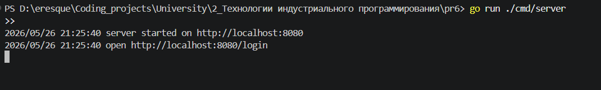
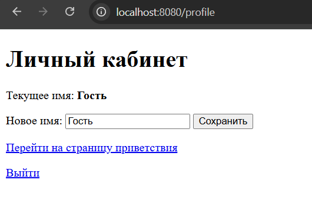
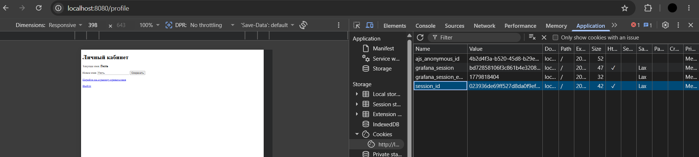
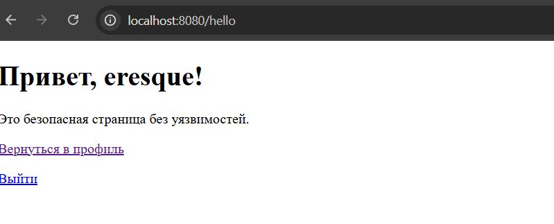
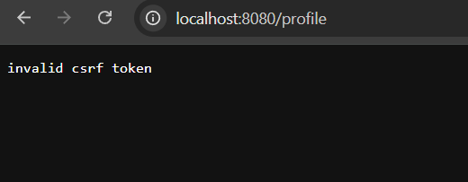
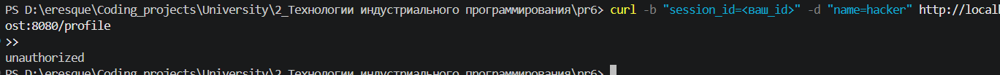
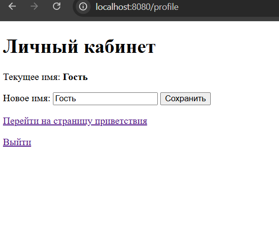

# Практическое занятие №6
# Защита приложения от CSRF/XSS. Работа с secure cookies

**Дисциплина:** Технологии индустриального программирования  
**Студент:** Гордеев Артём Ильич, ЭФМО-01-25

---

## Требования к проекту

- Go 1.21+
- Свободный порт 8080
- Стандартная библиотека Go (без внешних зависимостей)

---

## Краткое описание проекта

Реализовано минималистичное web-приложение на Go, демонстрирующее защиту от CSRF и XSS:

- `GET /login` — создаёт сессию, выдаёт HttpOnly cookie, перенаправляет на `/profile`
- `GET /profile` — отображает форму с именем пользователя и скрытым CSRF-токеном
- `POST /profile` — проверяет CSRF-токен, обновляет имя, ротирует токен, перенаправляет на `/hello`
- `GET /hello` — приветствует пользователя; шаблонизатор Go экранирует HTML — XSS невозможен
- `GET /logout` — удаляет сессию из памяти, обнуляет cookie (доп. задание 1)

Cookie выставляются с флагами `HttpOnly: true` и `SameSite: Lax`. Secure-флаг не включён для локального HTTP (доп. задание 2 — объяснение ниже). CSRF-токен ротируется после каждого успешного POST `/profile` (доп. задание 3).

---

## Структура проекта

```
pr6/
├── cmd/
│   └── server/
│       └── main.go
├── internal/
│   ├── auth/
│   │   ├── cookie.go
│   │   └── csrf.go
│   ├── httpapi/
│   │   └── handler.go
│   └── store/
│       └── store.go
├── templates/
│   ├── profile.html
│   └── hello.html
└── go.mod
```

---

## Результаты выполнения (скриншоты)

### Запуск сервера
```
go run ./cmd/server
```


### Страница входа — GET /login (создание сессии и cookie)
```
# Открыть в браузере: http://localhost:8080/login
```


### Страница профиля — GET /profile с CSRF-токеном в форме
```
# Открыть в браузере: http://localhost:8080/profile
# Проверить DevTools → Application → Cookies: session_id с флагом HttpOnly
```


### Успешное обновление имени — POST /profile → редирект на /hello
```
# Заполнить поле "Новое имя" и нажать "Сохранить"
```


### Страница /hello — XSS-атака не сработала
```
# Ввести в поле имени: <script>alert('xss')</script>
# На странице /hello отобразится экранированный текст, а не alert
```


### Проверка блокировки CSRF — 403 Forbidden
```
# Выполнить в Postman/curl: POST http://localhost:8080/profile
# с корректным session_id cookie, но без csrf_token или с неверным значением
curl -b "session_id=<ваш_id>" -d "name=hacker" http://localhost:8080/profile
```


### Выход — GET /logout (доп. задание 1)
```
# Нажать ссылку "Выйти" или открыть: http://localhost:8080/logout
# После выхода /profile вернёт 401 Unauthorized
```


---

## Ответы на контрольные вопросы

**1. Что такое CSRF?**  
CSRF (Cross-Site Request Forgery) — атака, при которой злоумышленник вынуждает браузер аутентифицированного пользователя отправить запрос на другой сайт. Браузер автоматически прикрепляет cookie, поэтому сервер воспринимает запрос как легитимный.

**2. Почему cookie сама по себе не защищает, пока пользователь авторизован?**  
Cookie передаётся браузером автоматически к любому запросу на данный домен — независимо от того, с какого сайта инициирован запрос. Это именно то, что эксплуатирует CSRF-атака: сессионная cookie есть, но запрос сформирован вредоносной страницей.

**3. Что такое XSS?**  
XSS (Cross-Site Scripting) — внедрение вредоносного JavaScript-кода в страницу, отображаемую другим пользователям. Если данные, введённые пользователем, вставляются в HTML без экранирования, скрипт исполняется в браузере жертвы.

**4. Чем CSRF отличается от XSS?**  
CSRF эксплуатирует доверие сервера к браузеру пользователя — сервер не может отличить легитимный запрос от сфабрикованного. XSS эксплуатирует доверие браузера к контенту сервера — в страницу внедряется вредоносный код, исполняемый браузером жертвы.

**5. В чём роль CSRF-токена?**  
CSRF-токен — секретное значение, которое встраивается в форму и проверяется на сервере. Вредоносный сайт не может прочитать токен из-за Same-Origin Policy, поэтому не может сформировать корректный запрос. Сервер отклоняет запросы без валидного токена.

**6. Что делает флаг HttpOnly в cookie?**  
`HttpOnly: true` запрещает доступ к cookie через JavaScript (`document.cookie`). Даже при успешной XSS-атаке скрипт не сможет похитить сессионную cookie.

**7. Что даёт флаг Secure?**  
`Secure: true` разрешает отправку cookie только по HTTPS. Это защищает cookie от перехвата при передаче по незашифрованному HTTP. В локальной разработке используется `false`, но в production обязательно `true`.

**8. Какие режимы есть у SameSite?**  
- `Strict` — cookie отправляется только при переходе в рамках того же сайта  
- `Lax` — cookie отправляется при top-level навигации (переход по ссылке), но не при cross-site AJAX/form POST  
- `None` — cookie отправляется всегда (требует `Secure: true`)  
В данной работе используется `Lax` как разумный баланс безопасности и удобства.

**9. Почему нужно экранировать пользовательские данные в HTML через шаблонизатор?**  
Без экранирования символы `<`, `>`, `"`, `&` интерпретируются браузером как HTML-разметка. Злоумышленник может внедрить тег `<script>` или обработчик событий. Шаблонизатор Go (`html/template`) автоматически экранирует все вставляемые значения.

**10. Почему нельзя строить HTML конкатенацией строк?**  
При конкатенации строк нет гарантии экранирования. Если `name = "<script>alert(1)</script>"`, то `"<h1>Привет, " + name + "</h1>"` создаёт валидный XSS-вектор. Шаблонизатор знает контекст вставки и применяет соответствующее экранирование автоматически.

---

## Дополнительные задания

### Задание 1. Маршрут /logout
Реализован в [internal/httpapi/handler.go](internal/httpapi/handler.go) метод `Logout`:  
- удаляет сессию из in-memory хранилища  
- выставляет cookie с `MaxAge: -1` (браузер немедленно удаляет cookie)  
- перенаправляет на `/login`

### Задание 2. Флаг Secure для cookie
В [internal/auth/cookie.go](internal/auth/cookie.go) флаг `Secure` установлен в `false` намеренно, так как локальный сервер работает по HTTP. При развёртывании на HTTPS (production) необходимо изменить на `Secure: true` — без этого браузеры не будут отправлять cookie по незашифрованным соединениям.

### Задание 3. Ротация CSRF-токена
После каждого успешного `POST /profile` генерируется новый CSRF-токен и сохраняется в хранилище через `store.UpdateCSRFToken`. Старый токен становится недействительным, что предотвращает повторное использование перехваченного токена.
