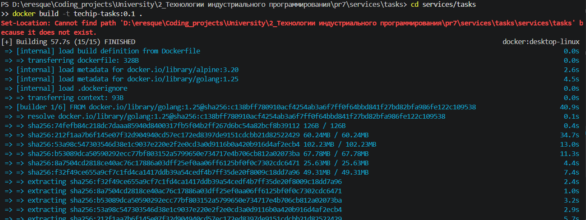
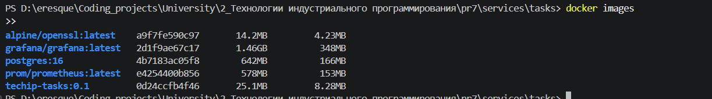
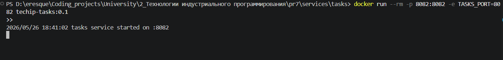
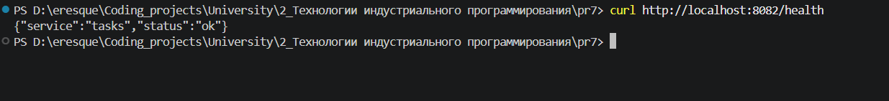
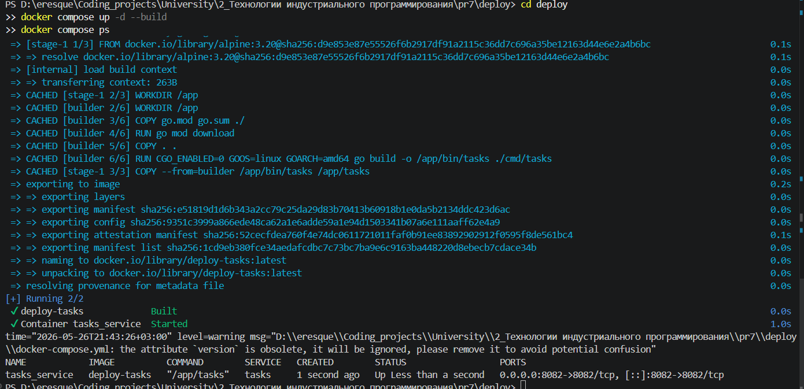
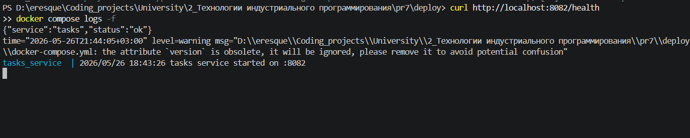

# Практическое занятие №7
# Написание Dockerfile и сборка контейнера

**Дисциплина:** Технологии индустриального программирования  
**Студент:** Гордеев Артём Ильич, ЭФМО-01-25

---

## Требования к проекту

- Go 1.23+
- Docker (Docker Desktop или Docker Engine)
- Docker Compose v2+
- Свободный порт 8082

---

## Краткое описание проекта

Реализован учебный HTTP-сервис **tasks** на Go, контейнеризированный с помощью Docker.  
Сервис отдаёт JSON-ответ на маршрут `/health`. Конфигурация порта передаётся через переменную окружения `TASKS_PORT`.

Применённые техники:
- **Multi-stage build** — сборка бинарника в образе `golang:1.23`, запуск в минимальном `alpine:3.20`;
- **.dockerignore** — исключение лишних файлов из build context;
- **Docker Compose** — декларативный запуск сервиса с пробросом портов и env-переменными.

---

## Структура проекта

```
pr7/
├── services/
│   └── tasks/
│       ├── cmd/
│       │   └── tasks/
│       │       └── main.go
│       ├── internal/
│       ├── go.mod
│       ├── go.sum
│       ├── Dockerfile
│       └── .dockerignore
├── deploy/
│   └── docker-compose.yml
└── README.md
```

---

## Результаты выполнения (скриншоты)

### Сборка Docker-образа

```bash
cd services/tasks
docker build -t techip-tasks:0.1 .
```



### Список образов после сборки

```bash
docker images
```



### Запуск контейнера вручную

```bash
docker run --rm -p 8082:8082 -e TASKS_PORT=8082 techip-tasks:0.1
```



### Проверка /health эндпоинта (docker run)

```bash
curl http://localhost:8082/health
```



### Запуск через Docker Compose

```bash
cd deploy
docker compose up -d --build
docker compose ps
```



### Проверка /health эндпоинта (Docker Compose)

```bash
curl http://localhost:8082/health
docker compose logs -f
```



---

## Ответы на контрольные вопросы

**1. Чем Docker-образ отличается от контейнера?**  
Docker-образ — это неизменяемый шаблон (слепок файловой системы и метаданных), описывающий, что именно должно запускаться. Контейнер — это запущенный экземпляр образа: живой процесс с собственным сетевым интерфейсом, файловой системой и состоянием. Один образ может порождать множество контейнеров.

**2. Зачем нужен Dockerfile?**  
Dockerfile — это инструкция по сборке образа: какой базовый образ взять, какие файлы скопировать, какие команды выполнить на стадии сборки, что запускать при старте контейнера. Он делает сборку воспроизводимой и версионируемой вместе с кодом.

**3. Что такое multi-stage build?**  
Multi-stage build — подход, при котором Dockerfile содержит несколько секций `FROM`. В первой секции происходит сборка артефакта (например, компиляция бинарника), во второй — копируется только готовый результат в минимальный базовый образ. Промежуточные слои с инструментами сборки в финальный образ не попадают.

**4. Почему для Go-сервисов удобно использовать multi-stage build?**  
Go компилируется в статически слинкованный бинарный файл. Это позволяет использовать образ `golang` только для сборки, а финальный образ — взять минимальный (`alpine` или даже `scratch`), содержащий лишь сам бинарник. Итоговый образ получается в разы меньше по размеру.

**5. Зачем нужен .dockerignore?**  
При запуске `docker build` весь указанный контекст отправляется Docker-демону. Без `.dockerignore` в контекст попадают `.git`, `node_modules`, логи, локальные сборки и прочие файлы, которые не нужны внутри образа. Это замедляет сборку и увеличивает размер build context.

**6. Для чего используются переменные окружения в контейнере?**  
Переменные окружения позволяют передавать конфигурацию (порт, адрес базы данных, уровень логирования и т.д.) в приложение без изменения образа. Это соответствует принципу 12-factor app: один и тот же образ запускается в dev, staging и production с разными env-переменными.

**7. Что делает флаг -p при запуске контейнера?**  
Флаг `-p host_port:container_port` пробрасывает порт из контейнера на хостовую машину. Без него приложение слушает порт только внутри изолированной сети контейнера, и обратиться к нему снаружи невозможно.

**8. Для чего нужен Docker Compose?**  
Docker Compose позволяет декларативно описать в YAML-файле несколько сервисов, их образы, порты, переменные окружения, зависимости и тома. Вместо нескольких ручных команд `docker run` достаточно одной: `docker compose up`. Это упрощает локальную разработку и воспроизводимый запуск мультисервисных приложений.

**9. Почему контейнеризация упрощает деплой?**  
Контейнер содержит всё необходимое для запуска: бинарник, зависимости и конфигурацию окружения. На целевой машине не нужно устанавливать Go, настраивать библиотеки или бороться с различиями версий. Один и тот же образ одинаково работает локально, в CI/CD, на VPS и в Kubernetes.

**10. Почему не стоит вшивать конфигурацию и секреты прямо в образ?**  
Образы хранятся в реестрах (Docker Hub, Registry) и могут быть доступны многим людям. Секреты (пароли, токены, ключи) в образе становятся скомпрометированными. Кроме того, для смены конфигурации пришлось бы пересобирать образ — вместо этого достаточно передать новую переменную окружения при запуске.
